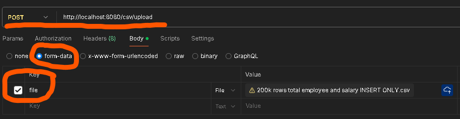

# How to run app locally:

1. Run docker-compose.yaml file
2. Write in terminal: ./gradlew bootRun
3. Flyway will pick up all flyway migration scripts and create tables in db (If you modify flyway script after running the application, you should repeat previous steps in order to apply changes otherwise you will get 'Migration checksum mismatch' error )

# How to use the app:

1. Send POST request to following url: "http://localhost:8080/csv/upload"

2. In POST request body include single "*.csv" file after choosing 'form-data' option, and use 'file' for param name (example screenshot attached bellow)

3. Post api will return uuid of generated json response (file processing will continue to be working in background, watch for logs to see when job is completed)

4. Reuse that uuid and send GET request to following url to get response (indexing might take up to minute on slow machines)
"http://localhost:8080/csv/:uuid"

Post example

# How app works:

1. I used docker-compose for running PostgreSQl locally
2. On each clean run of the application, flyway picks up the migration scripts from 'db.migration' file and initializes everything from there
3. On every new sql script that is added, flyway compares sha and initiates new one if it's missing in its table 'flyway_history'
4. App exposes 2 endpoints, one for uploading of csv file, one for fetching produced json file from db
5. I used semaphore to control concurrent run of the application because app is fairly fast on some mid-end machine and can finish task in less than a minute for 50k rows (50k rows to be inserted in 'person' table and 100k rows into 'salary_component' table)
6. How is processing of CSV files done? By using spring batch api which allows to process file in chunks (which size can be changed by editing 'batch-config:chunk-size' property)
7. Spring batch job contains 1 step which contains 3 consecutive processes that happen in order during 1 chunk: CsvFileReader -> CsvLinesProcessor -> JsonAndDatabaseWriter
8. If chunk size is equal to 1000, that means CsvFileReader will read maximum of 1000 rows from file, CsvLinesProcessor will process maximum of 1000 rows, JsonAndDatabaseWriter will write maximum of 1000 rows
9. CsvFileReader reads csv lines by using opencsv library which allowed me to map columns from csv directly to Java pojo class called EmployeeRecord
10. CsvLinesProcessor receives EmployeeRecord-s from CsvFileReader and tries to map each EmployeeRecord by action type (add, update, delete) to Action class (HireAction, ChangeAction and TerminateAction)
11. If Action fails validation while its being mapped or is duplicate or can't be applied because it updates row which doesn't exist in db nor in previous processed chunks, it will be marked for skip during write and saved in exception list
12. JsonAndDatabaseWriter reads processed Actions and writes them to database/json if flag 'shouldBeSkippedDuringWrite= false' or writes them to json errors list if they failed some validation 
13. Spring batch handles each chunk in separate transaction so i used BatchJobCache bean to store everything i need between chunks
14. I used SpringBatch listeners to:
- copy uploaded CSV file to app directory in order to process it and remove it after job
- create json file from processed csv lines, save it to db and remove it after job
- load cache which i used between chunks
- create a view in db for Person -> Salary
- release semaphore that locks csv file upload moment
15. Only 1 upload is allowed at the time, every other try to upload csv will be rejected until current one finishes
16. To get more informative sql/hibernate logs, uncommment: 'logging.level.net.ttddyy.dsproxy.listener: debug' line in application.yaml file

# Issues/obstacles i faced during development:
1. Hibernate batch insert/update performance was slow so i researched a lot and did some performance testing and decided to completely move away from hibernate batching and to use UNNEST ability of Postgresql which allowed to create big insert/update queries and increase performance (15x)
2. Lots of validations all over the place, i tried to logically group them into 1 place as much as it was possible
3. Decision between allowing concurrent run of batch job (which i think is too complex to implement and maybe overkill and would take more time) and single batch job per instance which i think is better choice because of how performant current implementation is
4. I spent some time thinking about how to remove old salary components in order to save db space but decided just to flag it as deleted in the end
5. Probing and testing app with all sorts of combinations to achieve proper validation and performance

# Some thoughts about assignment:
1. Assignment was very interesting and i had great time while developing it
2. I tried to cover all possible cases for 'Task Level 2' but then i figured out late that i misunderstood the part about 'bonus points for an SQL script that inserts the same data as the hypothetical
   REST API would based on the JSON' so i will skip this bonus feature
3. The app is missing junit tests i know (didnt have time to cover everything) but i tried to cover it with some e2e tests which also include original csv input
4. App is missing OpenApi specification (which is standard in these times)
5. I have started implementation of the app expecting several thousands of rows so logic was created around performance

# Tech stack used
- Spring Boot (Spring Batch)
- Gradle
- PostgreSQL/flyway/docker-compose for db
- Hibernate/JPA/JdbcTemplate
- RestApi
- OpenCsv(to map csv rows to pojos)
- Testing: JUnit 5,Spring Batch Test, TestContainers

# Application doesn't allow uploading the file after some exception occured during previous upload?
If there is some exception i didn't cover (which can definitely happen), spring batch job could possibly fail and stay in idle state and won't allow new job to be run.
Way to fix: Set columns 'status = COMPLETED' and 'exit_code = COMPLETED' in batch_job_execution table in database and retry, it should work again.

